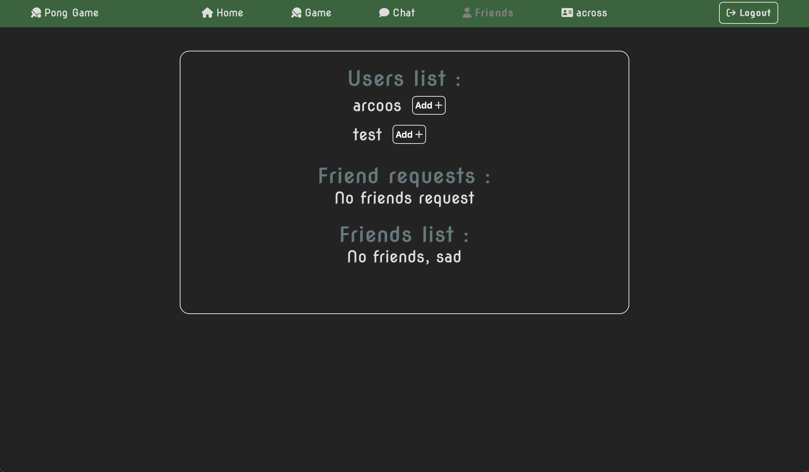
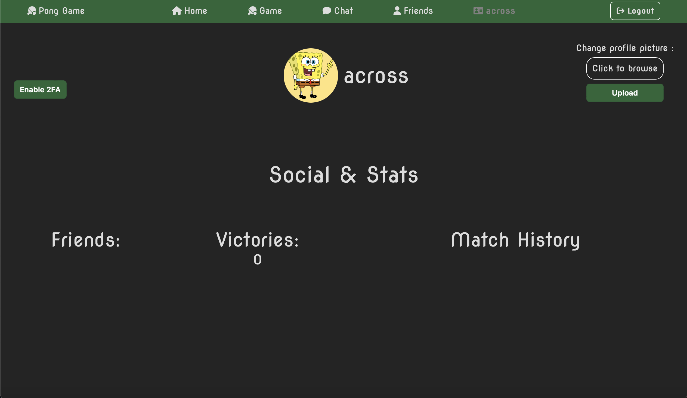
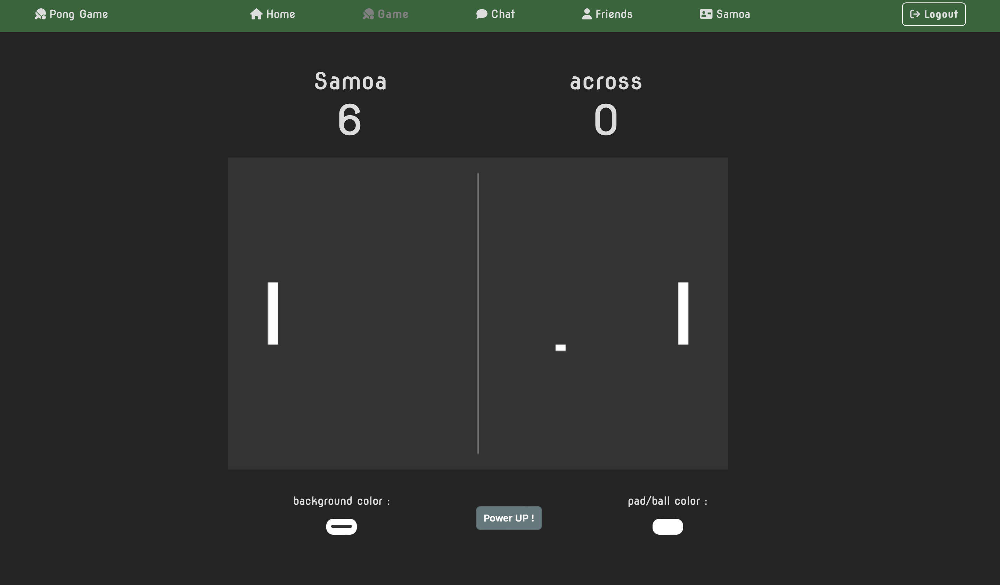
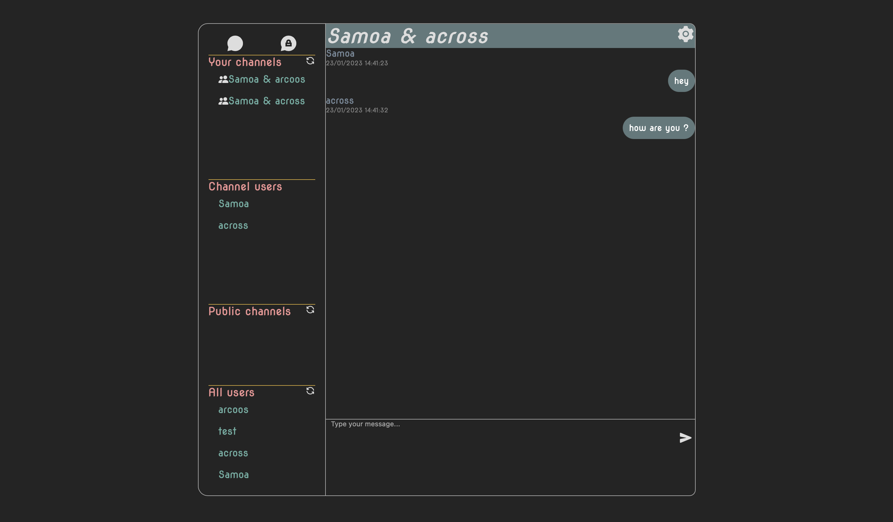
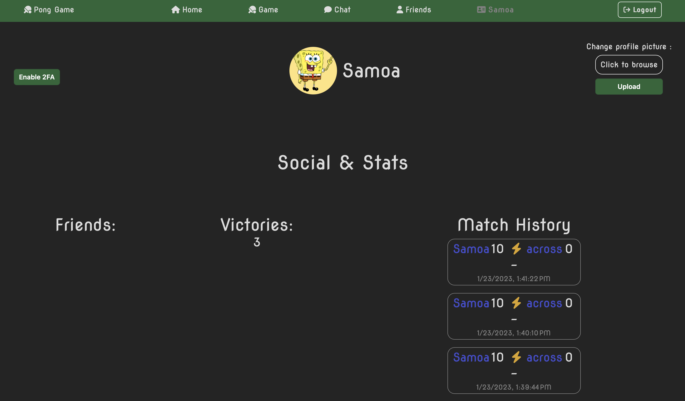

# 42-ft_transcendance
This is the famous full-stack project at 42 !

## Stack :
- NestJs backend
- React frontend
- PostgreSQL database

## Specs :
- Online two player pong game
- Chat with channels, admins and advanced channel management...
- Game spectators
- User profile page
- Friends and status visibility, profile picture...

## Constraints :
- Single-page web app
- 3 Docker containers for front, back and database
- Hashed passwords
- 42 intra API logging
- Google double authentication

## Choices :
- Prisma ORM
- SocketIO
- Google authenticator

## Overview :

